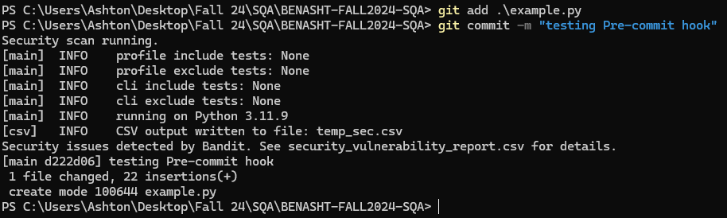
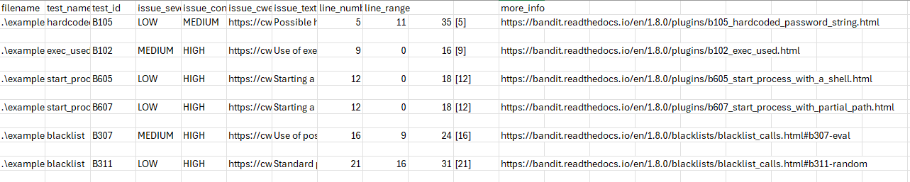
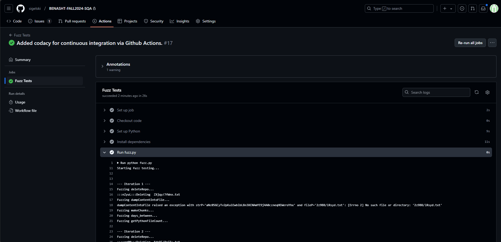
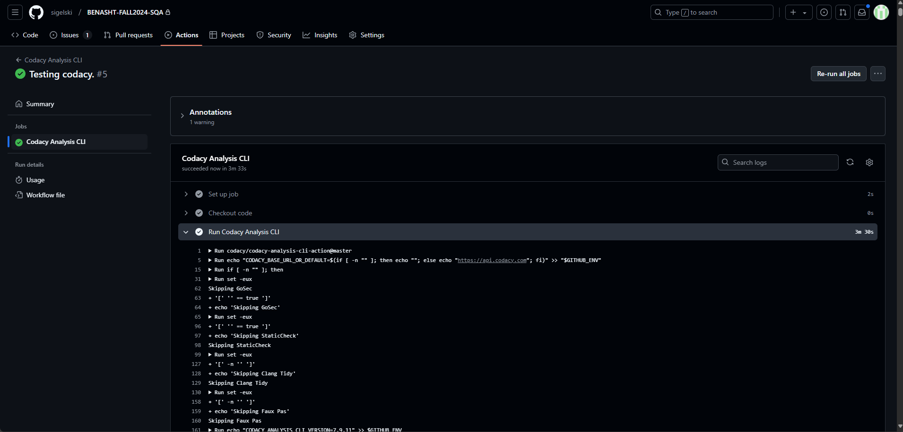

# BENASHT-FALL2024-SQA/REPO.md

## Git Hooks
### Prompt:

Create a Git Hook that will run and report all security weaknesses in the project in a CSV file whenever a Python file is changed and committed. (20%)

### Pre-commit Hook:
Using Bandit as the scannign software, we created a pre-commit hook that would scan any modified python files, and generate a csv in the root directory of the repository if any issues were found:

```
REPORT="security_vulnerability_report.csv"

TEMP=$(mktemp)

# Gets the list of all staged Python files if there are any (should be).
git diff --cached --name-only --diff-filter=ACM | grep '\.py$' > "$TEMP"

# Check if there are any Python files to scan
if [ -s "$TEMP" ]; then
    echo "Security scan running."

    echo "filename,test_name,test_id,issue_severity,issue_confidence,issue_cwe,issue_text,line_number,line_range,,,more_info" > "$REPORT"

    # Runs Bandit on each staged Python file, and then appends the results to the REPORT.
    while IFS= read -r file
    do
        if [ -f "$file" ]; then
            bandit -f csv -o temp_sec.csv "$file"
            tail -n +2 temp_sec.csv >> "$REPORT"
        fi
    done < "$TEMP"

    rm temp_sec.csv

    if [ $(wc -l < "$REPORT") -gt 1 ]; then
        echo "Security issues detected by Bandit. See $REPORT for details."
    else
        echo "No security issues found by Bandit."
        rm "$REPORT"
    fi
else
    echo "No Python files staged for commit. Skipping Bandit scan."
fi

rm "$TEMP"

exit 0
```
    





## Fuzzing

### Prompt:

Create a fuzz.py file that will automatically fuzz 5 Python methods of your choice. Report any bugs you discovered by the fuzz.py file. fuzz.py will be automatically executed from GitHub actions. (20%)

### Fuzz.py & Fuzz.yml
A file named fuzz.py was created, with its purpose being to fuzz 5 methods in mining.py:

```
from MLForensics.mining.mining import (
    deleteRepo,
    dumpContentIntoFile,
    makeChunks,
    days_between,
    getPythonFileCount
)
```

We can generate random strings, dates, etc. to test. The fuzz.py file is ran via a GitHub workflow named fuzz.yml located in .github\workflows. The results of one 10 iterations of this fuzzing test can be seen below, along with a screenshot of the GitHub action succeeding in the repo:

```
Starting fuzz testing...

--- Iteration 1 ---
Fuzzing deleteRepo...
:::nZyuL:::Deleting  ZXjqy/7fWnx.txt
Fuzzing dumpContentIntoFile...
dumpContentIntoFile raised an exception with strP='aNc05GCyTv2pKulEwbibL8n3XCNAmYE9j4A0czneqHEWeroYhx' and fileP='2z9B8/lRsyd.txt': [Errno 2] No such file or directory: '2z9B8/lRsyd.txt'
Fuzzing makeChunks...
Fuzzing days_between...
Fuzzing getPythonFileCount...

--- Iteration 2 ---
Fuzzing deleteRepo...
:::ugg0M:::Deleting  8dnPi/RrjIv.txt
Fuzzing dumpContentIntoFile...
dumpContentIntoFile raised an exception with strP='bMLDXnjTGjufwUFZ2oZKtUWMKRoJc2XdaFSCXBxQncLWszDz6n' and fileP='0pQIo/G11IZ.txt': [Errno 2] No such file or directory: '0pQIo/G11IZ.txt'
Fuzzing makeChunks...
Fuzzing days_between...
Fuzzing getPythonFileCount...

--- Iteration 3 ---
Fuzzing deleteRepo...
:::6qst7:::Deleting  pCcX4/mBWlA.txt
Fuzzing dumpContentIntoFile...
dumpContentIntoFile raised an exception with strP='LqX7Ab8bZDiSVu2hyAoHRm3NvRTlMPOCYQOwBInQiFUKEFwYn6' and fileP='cvpDr/o1ZaT.txt': [Errno 2] No such file or directory: 'cvpDr/o1ZaT.txt'
Fuzzing makeChunks...
Fuzzing days_between...
Fuzzing getPythonFileCount...

--- Iteration 4 ---
Fuzzing deleteRepo...
:::MZGZD:::Deleting  KGjMV/EwmdA.txt
Fuzzing dumpContentIntoFile...
dumpContentIntoFile raised an exception with strP='o7i96LuHWqKZHTDhj3Wj8KqJTjXBXin4gj8gKp5zA8ovedJRUb' and fileP='yamko/DsyCV.txt': [Errno 2] No such file or directory: 'yamko/DsyCV.txt'
Fuzzing makeChunks...
Fuzzing days_between...
Fuzzing getPythonFileCount...

--- Iteration 5 ---
Fuzzing deleteRepo...
:::XzIeC:::Deleting  5l1fW/28i3W.txt
Fuzzing dumpContentIntoFile...
dumpContentIntoFile raised an exception with strP='tAecGyIUoCeJl5wvMQfrz4xfANWYwyUZgUetrhB3I0IwEMa2U4' and fileP='lHpIj/u963L.txt': [Errno 2] No such file or directory: 'lHpIj/u963L.txt'
Fuzzing makeChunks...
Fuzzing days_between...
Fuzzing getPythonFileCount...

--- Iteration 6 ---
Fuzzing deleteRepo...
:::cRq12:::Deleting  B2PFK/n3sCX.txt
Fuzzing dumpContentIntoFile...
dumpContentIntoFile raised an exception with strP='Q9H968wzjSCJ4rJhZG9a4qfdvjdlmblonFkxkWey1X3hfUR6ZB' and fileP='X7FBW/HKny1.txt': [Errno 2] No such file or directory: 'X7FBW/HKny1.txt'
Fuzzing makeChunks...
Fuzzing days_between...
Fuzzing getPythonFileCount...

--- Iteration 7 ---
Fuzzing deleteRepo...
:::9d6RY:::Deleting  5FelE/Kqzwz.txt
Fuzzing dumpContentIntoFile...
dumpContentIntoFile raised an exception with strP='gTpucXS8M2m18vp6mwlLwJJDaa6dK5TnfWREdxrbOD30LgpIgO' and fileP='lSIne/HGGMs.txt': [Errno 2] No such file or directory: 'lSIne/HGGMs.txt'
Fuzzing makeChunks...
Fuzzing days_between...
Fuzzing getPythonFileCount...

--- Iteration 8 ---
Fuzzing deleteRepo...
:::p9WZr:::Deleting  ngQ1E/zTfPQ.txt
Fuzzing dumpContentIntoFile...
dumpContentIntoFile raised an exception with strP='cYPK5Xd7ctKube5IWJFI409KLEOseCTHsNGE1CLxOTtcOtXmqN' and fileP='Jr0Ap/6Rtyg.txt': [Errno 2] No such file or directory: 'Jr0Ap/6Rtyg.txt'
Fuzzing makeChunks...
Fuzzing days_between...
Fuzzing getPythonFileCount...

--- Iteration 9 ---
Fuzzing deleteRepo...
:::g4bLf:::Deleting  G2HT9/MkZal.txt
Fuzzing dumpContentIntoFile...
dumpContentIntoFile raised an exception with strP='DhHrjnQpYAw83jT7ClpTWQ1fSecI1Yjq93f8muz8zrrwKEMhT9' and fileP='NMGGC/9aMXF.txt': [Errno 2] No such file or directory: 'NMGGC/9aMXF.txt'
Fuzzing makeChunks...
Fuzzing days_between...
Fuzzing getPythonFileCount...

--- Iteration 10 ---
Fuzzing deleteRepo...
:::S0DSd:::Deleting  EhH43/PUdTw.txt
Fuzzing dumpContentIntoFile...
dumpContentIntoFile raised an exception with strP='WpOTE83UFfDwsqoeoQdpPfD0YYrm1qu9lv8d2EZliYdvQ4rhgY' and fileP='Yvh7m/9cXCR.txt': [Errno 2] No such file or directory: 'Yvh7m/9cXCR.txt'
Fuzzing makeChunks...
Fuzzing days_between...
Fuzzing getPythonFileCount...

Fuzzing has been completed!
```



## Forensics

### Prompt:

Integrate forensics by modifying 5 Python methods of your choice. (20%)

### Mining.py:
For forensics, we integrated logging into 5 methods of mining.py. They are  (cloneRepo, deleteRepo, dumpContentIntoFile, getDevDayCount, and cloneRepos). The logging saves to mining.log in the root directory of the repository. Due to the nature of the file and not being able to run the full code, we were only able to capture a limited amount of the logging, though the code is there to catch more if the program were ever to be ran.

Below is one example of logging, and what the log file contains:

```
def deleteRepo(dirName, type_):
    logging.info(f"Attempting to delete repository: {dirName} | Type: {type_}") # Method 1 for implementing forensics.
    print(':::' + type_ + ':::Deleting ', dirName)
    try:
        if os.path.exists(dirName):
            shutil.rmtree(dirName)
            logging.info(f"Successfully deleted repository: {dirName}")
        else:
            logging.warning(f"Directory does not exist: {dirName}")
    except OSError as e:
        logging.error(f"Error deleting repository {dirName}: {e}. Will try manually.")
        print('Failed deleting, will try manually')  
```

```
2024-12-05 20:25:32 - INFO - Script started.
2024-12-05 20:28:09 - INFO - Script started.
2024-12-05 20:28:09 - INFO - Loaded repository list from security_vulnerability_report.csv
```

## GitHub Actions Integrations

### Prompt:

Integrate continuous integration with GitHub Actions. (20%)

### Codacy-analysis.yaml:

For continuous integration via GitHub actions, we utilized codacy. The file codacy-analysis.yaml was created to run as a workflow on any push. A successful run of the workflow can be seen below:



## Lessons Learned

